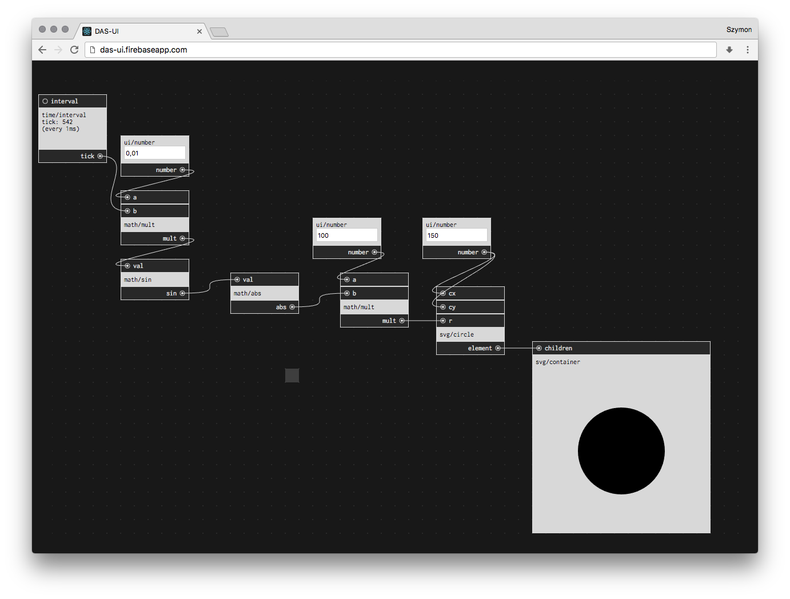

# DAS-UI

## domain-agnostic keyboard-based visual programming language

Live: [https://das-ui.firebaseapp.com](https://das-ui.firebaseapp.com)

Made with [react](https://facebook.github.io/react/), [redux](https://github.com/reactjs/redux), [RxJS](https://github.com/Reactive-Extensions/RxJS) and [immutable](https://facebook.github.io/immutable-js/).

## Run

1. clone this repo
2. `yarn` or `npm install`
3. `yarn run start` or `npm start`

## Build

1. `yarn run build` or `npm run build`

